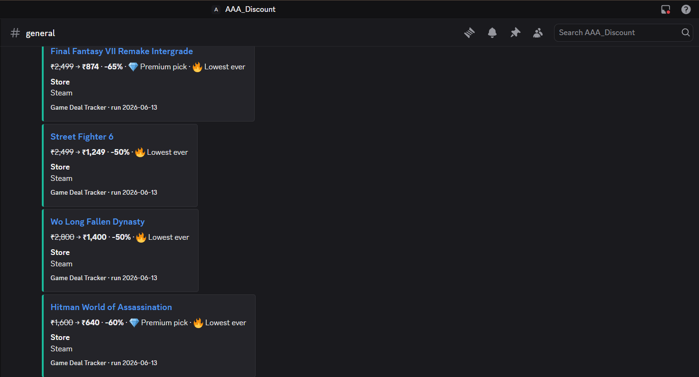
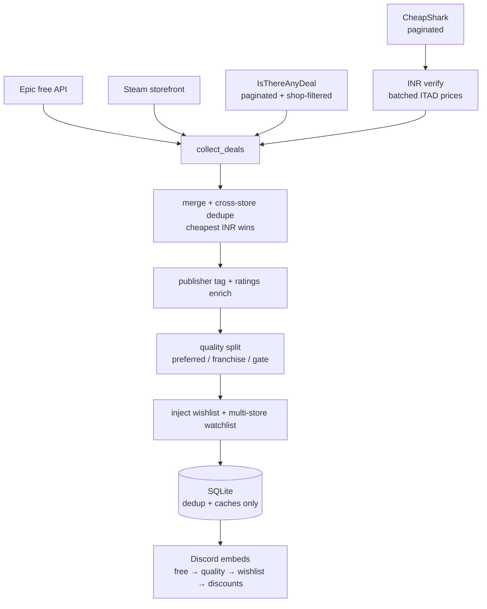

# 🎮 Game Deal Tracker

Game Deal Tracker is a self-hosted Python automation bot that aggregates live video-game deals from
four storefront APIs (IsThereAnyDeal, CheapShark, Steam, Epic), verifies prices in the user's
region/currency, classifies them by publisher/franchise/quality, de-duplicates against history, and
posts curated alerts to Discord as rich embeds — running unattended on a daily schedule. SQLite is
used purely for dedup and caching; secrets are env-isolated and never committed.

A self-hosted Python bot that finds **free games** and **quality discounts** across multiple
stores, checks whether they're actually worth playing (review scores, Metacritic, publisher),
and posts them to **Discord** as rich embeds — region-locked to your country's prices and
remembering what it has already shown so you only hear about new deals.


---

## ⚠️ Disclaimer

- This is a **personal, educational project**, not affiliated with or endorsed by Valve/Steam,
  Epic Games, IsThereAnyDeal, CheapShark, or Discord.
- It only reads **public data** and uses **official, free APIs** within their normal rate limits.
  It does **not** automate purchases, log into your Steam account, or scrape anything behind a login.
- You supply **your own** API keys and webhook. **No secrets are included in this repository** —
  you create a local `.env` (which is gitignored) from the provided `.env.example`.
- Prices, availability, and store data are best-effort and can be wrong or stale; always confirm
  on the store page before buying. Provided **as-is, with no warranty** (see [LICENSE](LICENSE)).
- Respect each service's Terms of Service. You are responsible for how you run and configure this.

---

## ✨ What it does

Each run, the bot:

1. **Queries the stores' own deal databases** — **Epic** (free games), **Steam** (free promos +
   storefront), **CheapShark** (cross-store discovery), and **IsThereAnyDeal**. The ITAD and
   CheapShark feeds are **paginated and shop-filtered** to your allowed stores, so discovery
   ingests the *full live deal set* for those shops (bounded by `feed_max_deals`) rather than a
   single biased top page.
2. **Region-locks** them — discovered USD deals are re-verified in your currency (default INR) via
   a batched ITAD price lookup; anything you can't buy in your region is dropped.
3. **Judges quality** — attaches Steam review summary (e.g. *Very Positive · 94%*), review count,
   Metacritic, publisher/developer and genres, then trims junk with a configurable review/Metacritic gate.
4. **Highlights what you care about**:
   - 🆓 **Free games** first (Epic giveaways, Steam 100%-off / free weekends).
   - 🏷️ **Quality picks** — games whose publisher/developer matches your preferred list (attached on
     the **live feed**, cache-first then ITAD), your manual **watchlist** (priced across *all* your
     allowed stores), and whole **franchises** (e.g. anything *Resident Evil* / *Dark Souls*).
   - 💜 **Wishlist hits** — anything on your Steam wishlist on sale at any discount (optional).
   - 💸 **Discounts** — everything else above your threshold.
5. **Badges**: 💎 *Premium pick* (an expensive game now meaningfully cheaper — configurable by
   absolute price, discount %, or both), 🔥 *Lowest ever* (per-store, or true all-store all-time
   low), 📉 *Cheaper than before* (undercuts its recent low).
6. **Posts only new deals** — a local SQLite DB remembers what you've seen (and re-notifies when a
   deal gets *even cheaper*). A deal is marked seen only after Discord accepts the post.

Output order is fixed: **free → quality picks → wishlist → discounts**.

---

## ⚠️ Known limitations

- **Epic Games paid deals**: Epic's coverage on ITAD is best-effort and occasionally lags by a few
  hours. Epic free giveaways are unaffected (fetched directly from Epic's own API). If an
  Epic-exclusive paid sale is missing, it will usually appear on the next scheduled run.
- **Publisher metadata**: ITAD metadata gaps may mean a small number of games from your
  `preferred_publishers` list go unclassified in a given run. Franchise matching (title substring)
  is always reliable — if a title contains "Resident Evil", "Dark Souls" etc. it will always be
  classified correctly regardless of metadata.
- **Quiet days**: on days with no major publisher sales, Quality Picks may have only 2–5 entries.
  This is accurate — it reflects what is genuinely on sale, not a bug.

---

## 🖼️ Screenshots



> A live run posting deal embeds to a Discord channel. If you fork this, replace
> `docs/screenshot.png` with a capture of your own channel.

---

## 🏗️ Architecture

Discovery is **feed-driven**: the bot queries each store's live deal database and treats SQLite as
**cache + dedup only** — it never stores a local list of games.



A deal is marked seen **only after** Discord accepts the message carrying it, so a failed post is
retried on the next run instead of being lost.

---

## 🚀 Implementation steps

### 1. Clone and install

```bash
git clone https://github.com/YOUR_USERNAME/game-deal-tracker.git
cd game-deal-tracker
python -m venv venv && source venv/bin/activate   # Windows: venv\Scripts\activate
pip install -r requirements.txt
```

Requires **Python 3.11+**.

### 2. Get your keys (all free)

| Secret | Where to get it | Required? |
|---|---|---|
| `DISCORD_WEBHOOK_URL` | Discord → Server → channel → *Edit Channel → Integrations → Webhooks → New* | ✅ Required |
| `ITAD_API_KEY` | https://isthereanydeal.com → account → **API Keys** (not the OAuth client secret) | ✅ Required |
| `STEAM_ID64` | https://steamid.io (paste your profile URL → 17-digit number) | ⬜ Optional — enables wishlist alerts |
| `STEAM_API_KEY` | https://steamcommunity.com/dev/apikey | ⬜ Optional — only the no-ITAD-key watchlist fallback uses it |

> `STEAM_ID64` is a **public** identifier, not a login — the bot never asks for your Steam
> username/password. For wishlist alerts your Steam **profile → Privacy → Game details** must be
> **Public**.

### 3. Configure

```bash
cp .env.example .env                  # paste your secrets here (gitignored, never committed)
cp config.example.yaml config.yaml    # optional — tweak region/threshold/publishers/features
python -m src.main --check-config     # validates setup WITHOUT printing any secret value
```

`config.yaml` is optional; without it the built-in defaults apply. Every tunable is documented in
[`config.example.yaml`](config.example.yaml).

### 4. Run

```bash
python -m src.main --dry-run   # prints the exact Discord embed JSON instead of posting
python -m src.main             # posts to Discord for real
python -m src.main -v          # -v (INFO) or -vv (DEBUG) for verbose logs
python -m src.main --stats     # summary of recent runs (found / new / errors)
```

### 5. Schedule it (so it runs daily on its own)

**Local — Windows (Task Scheduler):** Create Basic Task → Daily → *Start a program* → program
`python`, arguments `-m src.main`, **Start in** = the repo folder.

**Local — Linux/macOS (cron):** `crontab -e` →
```
30 9 * * * cd /path/to/game-deal-tracker && ./venv/bin/python -m src.main
```

**Cloud — GitHub Actions:** push the repo, then **Settings → Secrets and variables → Actions** and
add `DISCORD_WEBHOOK_URL`, `ITAD_API_KEY` (+ optional `STEAM_ID64`, `STEAM_API_KEY`). The included
[`daily.yml`](.github/workflows/daily.yml) runs at **03:30 UTC ≈ 09:00 IST** and can be triggered
manually from the Actions tab. The dedup DB is persisted via the Actions cache (best-effort).

---

## ⚙️ Configuration reference (`config.yaml`)

All keys are optional; defaults shown. See [`config.example.yaml`](config.example.yaml) for inline notes.

| Key | Default | Meaning |
|---|---|---|
| `region` / `currency` | `IN` / `INR` | Store region for prices/availability; display currency |
| `min_discount_pct` | `70` | Discount threshold for the deals section |
| `discovery_discount_pct` | `50` | Sources fetch down to this %, but sub-threshold deals are kept only if premium/preferred/wishlisted/franchise |
| `dedup_expiry_days` | `30` | Forget seen deals older than this |
| `ratings_cache_days` | `7` | Re-fetch review scores after this many days |
| `max_deals_per_run` | `30` | Caps enrichment / per-title price-checks per run (no longer sizes the feed) |
| `feed_max_deals` | `800` | Total deals ingested per paginated store feed (50–5000) |
| `feed_page_sleep` | `0.5` | Seconds slept between feed pages (API courtesy; 0–5) |
| `publisher_metadata_batch` | `100` | Max ITAD publisher-info lookups per run (cache-first) |
| `max_discounts_per_run` | `0` | 0 = unlimited; caps the discount section only |
| `preferred_publishers` | `[]` | Devs/publishers pulled into the pinned "Quality picks" section (word-boundary, case-insensitive) |
| `preferred_mention` / `wishlist_mention` | `""` | Optional `@role`/`@everyone` mention on that section only |
| `min_review_pct` / `min_review_count` / `min_metacritic` | `0` | Quality gate for the regular discount list (0 = off; unknowns pass) |
| `premium_original_min` / `premium_sale_max` | `1000` / `500` | 💎 Premium-pick thresholds, INR (orig > min; sale ≤ max in absolute mode) |
| `premium_mode` | `either` | How 💎 is judged: `absolute` (sale ≤ max) / `percent` (cut ≥ min) / `either` / `both` |
| `premium_min_discount_pct` | `60` | Minimum discount for 💎 in `percent`/`either`/`both` modes |
| `min_original_price` | `0` | Hide paid deals whose **original** price (INR) is below this; free/wishlist/watchlist exempt (0 = off) |
| `exclude_early_access` | `false` | Drop Early Access / unreleased games |
| `exclude_genres` | `[]` | Drop games in these Steam genres |
| `include_genres` | `[]` | Keep **only** deals in these genres (allow-list; unknown genres pass; exclude wins) |
| `franchises` | `[]` | Promote any discovered title containing one of these names into Quality picks (overrides content filters) |
| `watchlist` | `[]` | Specific titles price-checked across all allowed stores every run; surface in Quality picks the moment they're on sale anywhere |
| `all_store_low` | `false` | 🔥 only when at the all-time low across **all** stores (ITAD), not just one |
| `price_drop_window_days` | `0` | 📉 flag deals cheaper than their low over the last N days (0 = off; warms up over a few days) |
| `ending_soon_hours` | `48` | Re-notify a deal once when within this many hours of ending (0 = off) |
| `stores` / `exclude_stores` | `[]` | Allowlist / blocklist of store names (case-insensitive substring) |
| `sections` | all | Which sections to post: `free, wishlist, preferred, discounts` |

### Per-run API budget

Discovery is **feed-driven**: each store's deal database is paged directly, so the work scales with
`feed_max_deals` rather than a local game list. A typical run makes roughly:

- **ITAD deals** — `ceil(feed_max_deals / 200)` paged requests (shop-filtered), `feed_page_sleep` apart.
- **CheapShark** — one paged sweep per allowed store (`pageSize` 60, the API hard cap).
- **INR verification** — one bulk Steam-appid→ITAD-id lookup and one `games/prices` call per **100**
  deals (not two calls per deal).
- **Publisher metadata** — cache-first, then at most `publisher_metadata_batch` ITAD `games/info`
  lookups, persisted so later runs skip them.
- **Watchlist** — title→ITAD-id lookups only on a cache miss (30-day cache), then a single batched
  `games/prices` call for all titles.

SQLite is now **dedup + caches only** — no locally stored game lists. Opening an old database
auto-drops the retired `app_index` / `derived_watchlist` tables and reclaims the space.

---

## 🧪 Tests

```bash
pip install -r requirements-dev.txt
pytest                 # all HTTP is mocked — runs fully offline, needs no keys
ruff check src tests   # lint
mypy src               # type-check
```

---

## 🔐 Security

No secret is ever committed: `.env`, `config.yaml`, and the local `*.db` are gitignored, and the
bot never prints secret values (`--check-config` reports only `set` / `MISSING`). If your Discord
webhook ever leaks, delete & regenerate it in the channel settings and update `.env`.

## 📜 License

[MIT](LICENSE).
